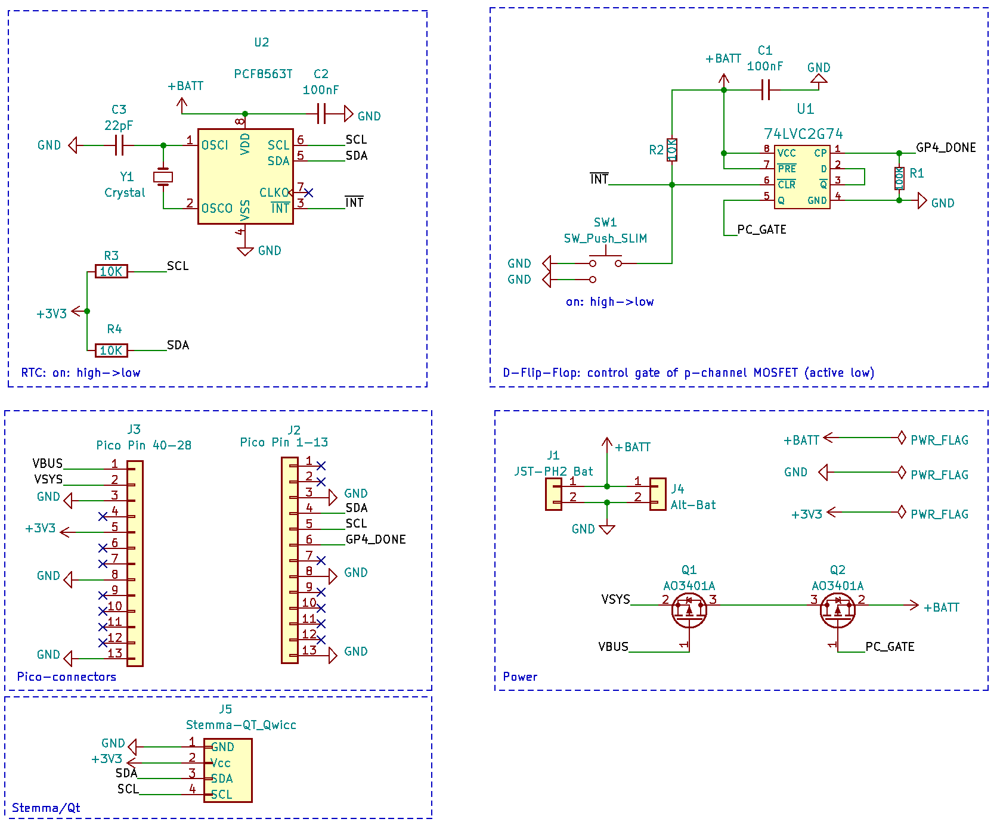

Pico Power Switch
=================

This is a simple breakout to switch the battery power for a Raspberry
Pi Pico to minimize battery usage.

Functions:
  * Enable using a button, a RTC or an external signal
  * Disable by pulling a GPIO high from your program
  * keep time

The target application of this design is a program that runs in
intervals. After startup the program executes it's tasks, sets
the next wakup time and then pulls the "done"-GPIO high.
The circuitry then cuts power, thus limiting the
battery consumption to a very low level.

The design of the breakout allows it to be connected directly on the bottom
side of the pico.

Hardware Components
-------------------

A D-type flip-flop drives the gate of a p-channel MOSFET and
switches power (source: battery, drain: VSYS). 
A button, the RTC or an external signal will reset the flip-flop.
This will pull the gate low, thus enabling power.

The "done"-pin of the Pico is connected to the CLK-pin of
the flip-flop. A rising edge will toggle the output and pull
the gate high, which in turn cuts power.

License
-------

[![CC BY-SA 4.0][cc-by-sa-shield]][cc-by-sa]

This work is licensed under a
[Creative Commons Attribution-ShareAlike 4.0 International
License][cc-by-sa].

[![CC BY-SA 4.0][cc-by-sa-image]][cc-by-sa]

[cc-by-sa]: http://creativecommons.org/licenses/by-sa/4.0/
[cc-by-sa-image]: https://licensebuttons.net/l/by-sa/4.0/88x31.png
[cc-by-sa-shield]:
https://img.shields.io/badge/License-CC%20BY--SA%204.0-lightgrey.svg
